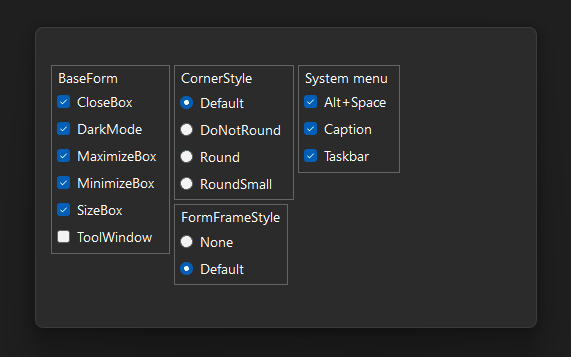
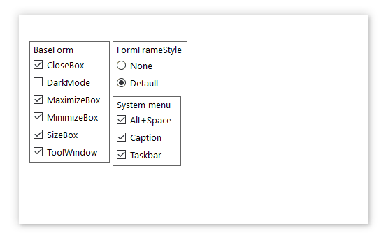
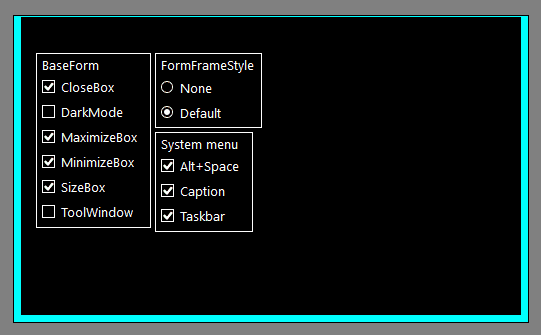
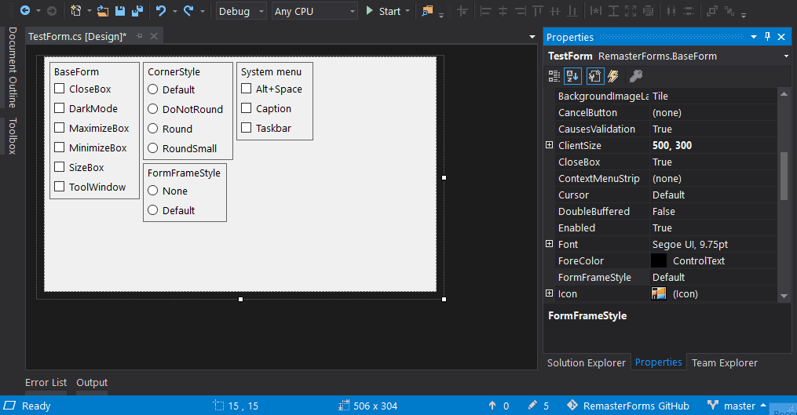

#RemasterForms 

RemasterForms is a platform for creating customized windows.

### Features
* Custom Window Border
* [Custom Title Bar](#planned)
* [Custom Window Menu](#planned)
* [Custom Color Themes](#planned)

#
##### Windows 11

##### Windows 10

##### High Contrast

##### Design Mode

#
### Description
>### Coming soon...  
>>### ! Important
>> [High DPI support in Windows Forms](https://learn.microsoft.com/en-us/dotnet/desktop/winforms/high-dpi-support-in-windows-forms?view=netframeworkdesktop-4.8)
>>
>> To support high DPI, an application must be configured in the App.config and App.manifest files (see the included TestApp project).  

#
### Planned
> To boost my work, please [support](#donation) this project with a [donation](#donation).

##### Custom Title Bar
* drawing buttons directly on the form
* binding other components to the caption

##### Custom Window Menu
* modifying system items and inserting new items

##### Custom Color Themes
* remastering of standard controls to support color themes

#
### Donation  
  
###### BUSD (BEP-20)  
###### [0xA1253F5b67274477A60A84979278D6De6484f507](https://link.trustwallet.com/send?coin=20000714&address=0xA1253F5b67274477A60A84979278D6De6484f507&token_id=0xe9e7CEA3DedcA5984780Bafc599bD69ADd087D56)  

###### USDT (TRC-20)  
###### [TSntPfU8aMiq12mndcmt2iWXqwD7TSKJum](https://link.trustwallet.com/send?coin=195&address=TSntPfU8aMiq12mndcmt2iWXqwD7TSKJum&token_id=TR7NHqjeKQxGTCi8q8ZY4pL8otSzgjLj6t)  

###### BTC  
###### [bc1qq6a757zpu5982j24xwfvx67l4hw96ulke5j0vc](https://link.trustwallet.com/send?coin=0&address=bc1qq6a757zpu5982j24xwfvx67l4hw96ulke5j0vc)  

###### ETH  
###### [0xA1253F5b67274477A60A84979278D6De6484f507](https://link.trustwallet.com/send?coin=60&address=0xA1253F5b67274477A60A84979278D6De6484f507)  
