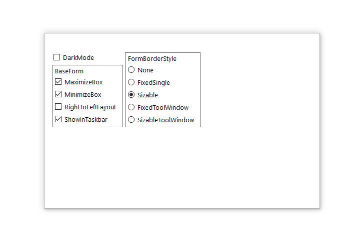
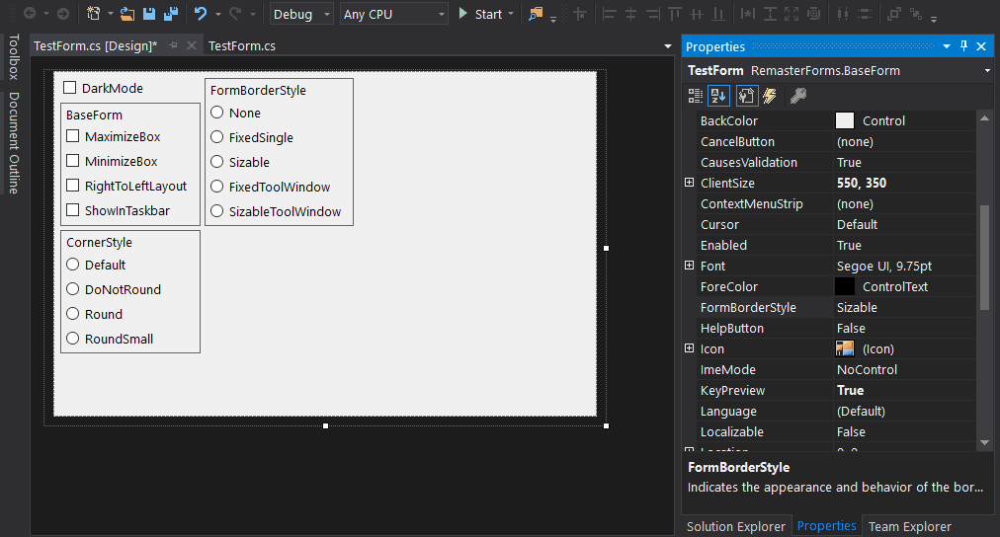

# RemasterForms 

RemasterForms is a platform for creating custom forms.

### Content
* [Custom Window Border](#description)
* [Custom Title Bar](#planned)
* [Custom System Menu](#planned)
* [Custom Color Themes](#planned)

#
##### Windows 11

##### Windows 10

##### High Contrast

##### Design Mode

#
### Description
>#### Features
>> Native transition animations  
>> Native DWM border *  
>> Improved system menu  
>> Snap layouts are supported  
>> Right-to-left mode is supported  
>> No use of undocumented functions  
>#### Full description coming soon...
>>#### ! Important
>> [High DPI support in Windows Forms](https://learn.microsoft.com/en-us/dotnet/desktop/winforms/high-dpi-support-in-windows-forms?view=netframeworkdesktop-4.8)
>>
>> To support high DPI, an application must be configured in the App.config and App.manifest files (see the included test project).

#
### Planned

> To boost my work, please [support](#donation) this project with a [donation](#donation).

##### Titlebar Preview

### Donation  
  
###### BUSD (BEP-20)
###### [0xA1253F5b67274477A60A84979278D6De6484f507](https://link.trustwallet.com/send?coin=20000714&address=0xA1253F5b67274477A60A84979278D6De6484f507&token_id=0xe9e7CEA3DedcA5984780Bafc599bD69ADd087D56)  

###### USDT (TRC-20)
###### [TSntPfU8aMiq12mndcmt2iWXqwD7TSKJum](https://link.trustwallet.com/send?coin=195&address=TSntPfU8aMiq12mndcmt2iWXqwD7TSKJum&token_id=TR7NHqjeKQxGTCi8q8ZY4pL8otSzgjLj6t)  

###### BTC
###### [bc1qq6a757zpu5982j24xwfvx67l4hw96ulke5j0vc](https://link.trustwallet.com/send?coin=0&address=bc1qq6a757zpu5982j24xwfvx67l4hw96ulke5j0vc)  

###### ETH
###### [0xA1253F5b67274477A60A84979278D6De6484f507](https://link.trustwallet.com/send?coin=60&address=0xA1253F5b67274477A60A84979278D6De6484f507)  
